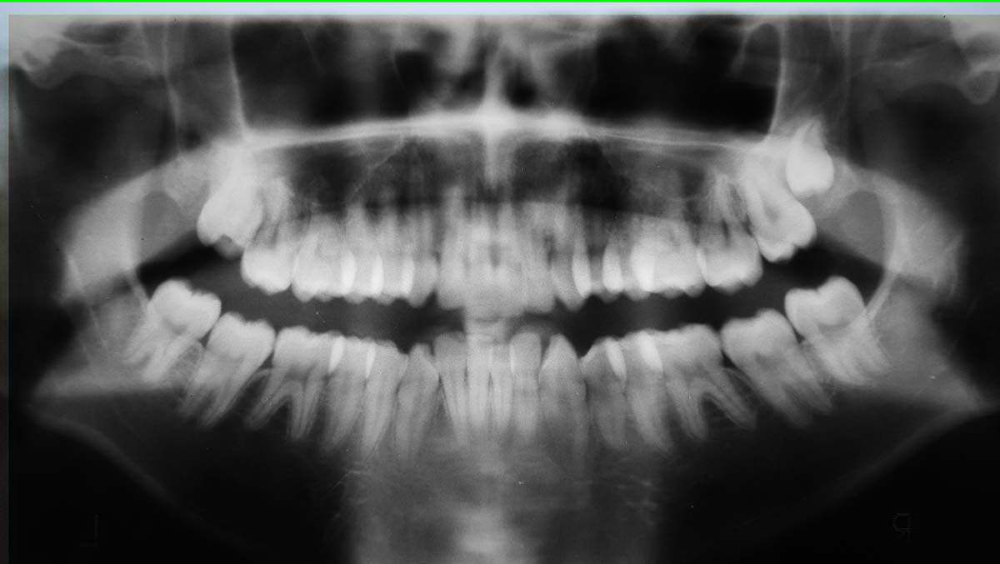
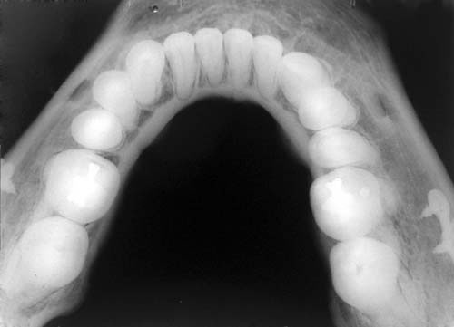
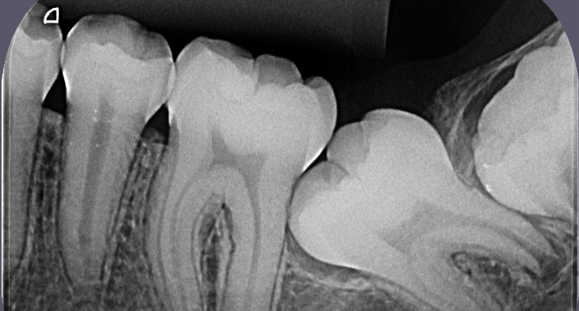
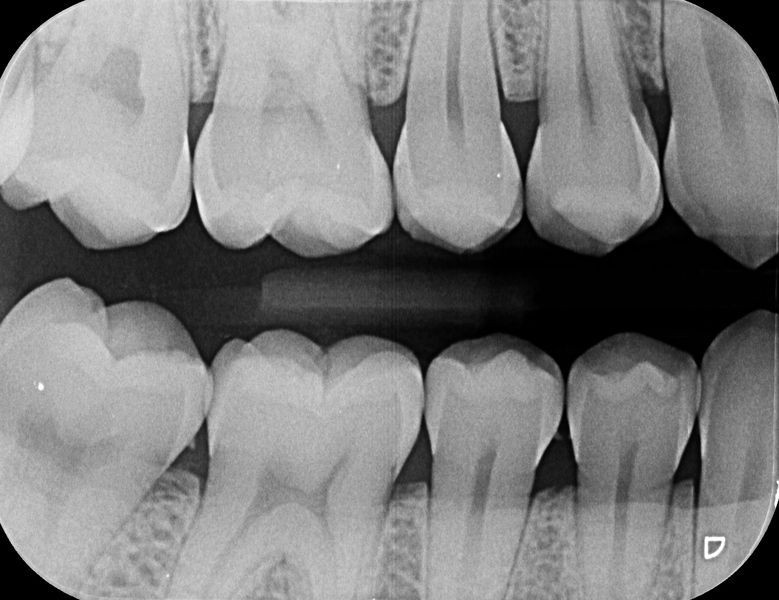

# Odonto x-ray image recognition (demo)
[TensorFlow](https://www.tensorflow.org/) is an open source library for numerical computation, specializing in machine learning applications.

In this demo, we'll train a simple classifier to classify images of odonto x-rays.



```bash
root@90fc08cfbe3b:~# python scripts/label_image.py \
>     --graph=tf_files/retrained_graph.pb  \
>     --image=tf_files/test/x-ray/panoramic/1.jpg

Evaluation time (1-image): 0.092s

xr panoramic (score=0.99866) <--------------
xr occlusal (score=0.00127)
xr periapical (score=0.00007)
document (score=0.00001)
xr interproximal (score=0.00000)
```



occlusal x-ray



periapical x-ray



interproximal x-ray

## What you need
* A basic understanding of Linux commands;
* Install docker;
* Download images for testing.

> If you're planning to retrain this neural network you'll need many images of each category, otherwise, skip to "Classifying an image" section.


## Clone repository

```bash
git clone https://github.com/asantos2000/tensorflow-odonto.git

cd tensorflow-odonto
```

## Running with docker

> $PWD is pointing to tensorflow-odonto directory

```bash
$ docker run -it -p 6006:6006 -p 8888:8888 -v $PWD:/root gcr.io/tensorflow/tensorflow:latest-devel bash
```

## Start TensorBoard (optinal)
Before starting the training, launch tensorboard in the background. TensorBoard is a monitoring and inspection tool included with tensorflow. You will use it to monitor the training progress.

```
root@90fc08cfbe3b:~# tensorboard --logdir tf_files/training_summaries &
```

# Retraining your model
> You need to add your images on tf_files/training directory. Each subdirectory will be your label. Ie: tf_files/training/xr-panoramic contain all x-ray panoramic images.
> Because of copyright reasons images are not included.

```bash
# set env variables for retrain
root@90fc08cfbe3b:~# export TF_CPP_MIN_LOG_LEVEL=2
root@90fc08cfbe3b:~# export IMAGE_SIZE=224
root@90fc08cfbe3b:~# export ARCHITECTURE="mobilenet_0.50_${IMAGE_SIZE}"

root@90fc08cfbe3b:~# python scripts/retrain.py \
  --bottleneck_dir=tf_files/bottlenecks \
  --how_many_training_steps=1453 \
  --model_dir=tf_files/models/ \
  --summaries_dir=tf_files/training_summaries/"${ARCHITECTURE}" \
  --output_graph=tf_files/retrained_graph.pb \
  --output_labels=tf_files/retrained_labels.txt \
  --architecture="${ARCHITECTURE}" \
  --image_dir=tf_files/training
```

# Classifying an image
Download an image from the internet (Ie: google images: x-ray panoramic) and try to classify it.

```bash
root@90fc08cfbe3b:~# python scripts/label_image.py \
>     --graph=tf_files/retrained_graph.pb  \
>     --image=tf_files/test/x-ray/periapical/1.jpg

Evaluation time (1-image): 0.082s

xr periapical (score=0.99999) <--------------
xr interproximal (score=0.00000)
xr occlusal (score=0.00000)
photo (score=0.00000)
document (score=0.00000)
```

```bash
root@90fc08cfbe3b:~# python scripts/label_image.py \
>     --graph=tf_files/retrained_graph.pb  \
>     --image=tf_files/test/x-ray/panoramic/1.jpg

Evaluation time (1-image): 0.092s

xr panoramic (score=0.99866) <--------------
xr occlusal (score=0.00127)
xr periapical (score=0.00007)
document (score=0.00001)
xr interproximal (score=0.00000)
```

```bash
root@90fc08cfbe3b:~# python scripts/label_image.py \
>     --graph=tf_files/retrained_graph.pb  \
>     --image=tf_files/test/x-ray/occlusal/1.jpg

Evaluation time (1-image): 0.084s

xr occlusal (score=0.99778) <--------------
xr panoramic (score=0.00133)
xr interproximal (score=0.00071)
photo (score=0.00008)
document (score=0.00007)
```

```bash
root@90fc08cfbe3b:~# python scripts/label_image.py \
>     --graph=tf_files/retrained_graph.pb  \
>     --image=tf_files/test/x-ray/interproximal/1.jpg

Evaluation time (1-image): 0.090s

xr interproximal (score=0.98379) <--------------
xr periapical (score=0.01621)
document (score=0.00000)
photo (score=0.00000)
xr panoramic (score=0.00000)
```

```bash
root@90fc08cfbe3b:~# python scripts/label_image.py \
>     --graph=tf_files/retrained_graph.pb  \
>     --image=tf_files/test/x-ray/panoramic/2.jpg

Evaluation time (1-image): 0.094s

xr panoramic (score=0.99979) <--------------
xr occlusal (score=0.00021)
xr periapical (score=0.00000)
document (score=0.00000)
xr interproximal (score=0.00000)
```

## Runnig jupyter-notebook
```bash
$ docker run -it -p 6006:6006 -p 8888:8888 -v $PWD gcr.io/tensorflow/tensorflow

root@90fc08cfbe3b:~# jupyter notebook --no-browser --ip=0.0.0.0 --allow-root

[I 12:36:15.433 NotebookApp] Serving notebooks from local directory: /root
[I 12:36:15.433 NotebookApp] 0 active kernels
[I 12:36:15.433 NotebookApp] The Jupyter Notebook is running at:
[I 12:36:15.434 NotebookApp] http://0.0.0.0:8888/?token=55cd2df445ccde8b0e45e7005352dcf9d0910b13aafeadc6
[I 12:36:15.434 NotebookApp] Use Control-C to stop this server and shut down all kernels (twice to skip confirmation).
```

## Contribute with this project
We're planning to extend functionali

## References and Issues

* [Tensorflow for poets tutorial](https://codelabs.developers.google.com/codelabs/tensorflow-for-poets)
* [Install docker](https://docs.docker.com/install/)
* [TensorFlow – KeyError: “The name ‘import/input’ refers to an Operation not in the graph](http://www.whatibroke.com/2017/09/03/tensorflow-keyerror-the-name-importinput-refers-to-an-operation-not-in-the-graph/)
* [CRITICAL: tensorflow:Category has no images - validation](https://stackoverflow.com/questions/38175673/critical-tensorflowcategory-has-no-images-validation)