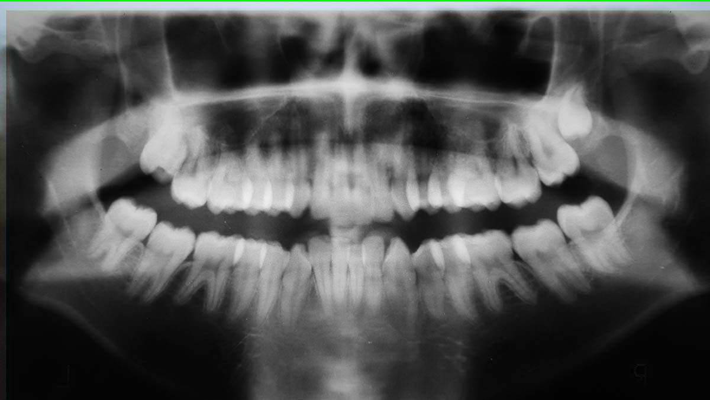

# Reconhecimento de imagens radiológicas

A tecnologia evoluiu incrivelmente nos últimos dez anos, computação na nuvem, sistemas distribuído com capacidade de atender um número ilimitado de usuários, aprendizado de máquina identificando imagens em tempo real, para mencionar alguns.



```bash
root@90fc08cfbe3b:~# python scripts/label_image.py \
>     --graph=tf_files/retrained_graph.pb  \
>     --image=tf_files/test/x-ray/panoramic/1.jpg

Evaluation time (1-image): 0.092s

xr panoramic (score=0.99866) <--------------
xr occlusal (score=0.00127)
xr periapical (score=0.00007)
document (score=0.00001)
xr interproximal (score=0.00000)
```


Todas essas tecnologias surpreendentes custam poucos dólares e estão ao alcance de todos.

Estamos conectando esses maravilhosas tecnologias ao seu negócio.

Estamos desenvolvendo e treinando sistemas de aprendizado de máquina para identificar, em raio-x odontológicos, obturações, implantes, pontes, etc.

Precisamos da sua ajuda para treinar nossos algoritmos de inteligência artificial. Nesta fase o estamos treinando para identificar tipos de raio-x, tais como panorâmico, oclusal, etc. Já obtivemos bons resultados, como você poderá ver nesta demo.

Para nos ajudar, clicque em uma das categorias abaixo para enviar as imagens digitais correspondentes:

* [Interproximal](https://dbinbox.com/interproximal)
* Oclusal
* Panorâmica
* Bitewing
* Cefalométricas
* Tomograma
* Sialografia

As imagens não precisam conter nenhuma identificação do paciente e elas não serão divulgadas ou exibidas em nenhuma midia eletrônica (páginas web, video, etc.). Uma vez que a IA é treinada com a imagem ela pode ser descartada.

Todos os cvolaboradores terão acesso ao software.

Caso queira adicionar categorias é só deixar um comentário nesta página.

<div id="disqus_thread"></div>

<script>

/**
*  RECOMMENDED CONFIGURATION VARIABLES: EDIT AND UNCOMMENT THE SECTION BELOW TO INSERT DYNAMIC VALUES FROM YOUR PLATFORM OR CMS.
*  LEARN WHY DEFINING THESE VARIABLES IS IMPORTANT: https://disqus.com/admin/universalcode/#configuration-variables*/
/*
var disqus_config = function () {
this.page.url = PAGE_URL;  // Replace PAGE_URL with your page's canonical URL variable
this.page.identifier = PAGE_IDENTIFIER; // Replace PAGE_IDENTIFIER with your page's unique identifier variable
};
*/
(function() { // DON'T EDIT BELOW THIS LINE
var d = document, s = d.createElement('script');
s.src = 'https://https-asantos2000-github-io-tensorflow-odonto.disqus.com/embed.js';
s.setAttribute('data-timestamp', +new Date());
(d.head || d.body).appendChild(s);
})();
</script>

<noscript>Please enable JavaScript to view the <a href="https://disqus.com/?ref_noscript">comments powered by Disqus.</a></noscript>